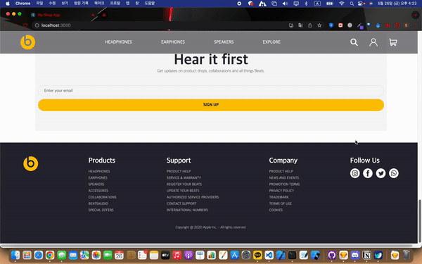

`@lastest-update readme post: 2023-05-26`



This project is Initialized create-react-app

Make Responsive Web Site

Site Link : https://sdf5771.github.io/my-shop/

Design Pattern : `Atomic Design Pattern`

Use Tech Stacks Version

- react : `18.2.0`
- gh-pages : `5.0.0`
- typescript : `4.9.5`
- react-responsive : `9.0.2`
- react-router-dom : `6.11.2`
- recoil : `0.7.7`
- styled-components : `5.3.10`

---

## 1. How to use

- Install Dependency Modules

```tsx
npm install
```

- Start

```tsx
npm start
```

---

## 2. Package.json

```tsx
{
  "name": "my-shop",
  "version": "0.1.0",
  "private": true,
  "dependencies": {
    "@testing-library/jest-dom": "^5.16.5",
    "@testing-library/react": "^13.4.0",
    "@testing-library/user-event": "^13.5.0",
    "@types/jest": "^27.5.2",
    "@types/node": "^16.18.32",
    "@types/react": "^18.2.6",
    "@types/react-dom": "^18.2.4",
    "@types/react-responsive": "^8.0.5",
    "gh-pages": "^5.0.0",
    "react": "^18.2.0",
    "react-dom": "^18.2.0",
    "react-responsive": "^9.0.2",
    "react-router-dom": "^6.11.2",
    "react-scripts": "5.0.1",
    "recoil": "^0.7.7",
    "styled-components": "^5.3.10",
    "typescript": "^4.9.5",
    "web-vitals": "^2.1.4"
  },
  "scripts": {
    "start": "react-scripts start",
    "build": "react-scripts build",
    "test": "react-scripts test",
    "eject": "react-scripts eject",
    "deploy": "gh-pages -d build",
    "predeploy": "npm run build"
  },
  "eslintConfig": {
    "extends": [
      "react-app",
      "react-app/jest"
    ]
  },
  "browserslist": {
    "production": [
      ">0.2%",
      "not dead",
      "not op_mini all"
    ],
    "development": [
      "last 1 chrome version",
      "last 1 firefox version",
      "last 1 safari version"
    ]
  },
  "devDependencies": {
    "@types/styled-components": "^5.1.26"
  },
  "homepage": "https://sdf5771.github.io/my-shop/"
}
```

---

## 3. Directories (Source Tree)

```tsx
.
├── Router.tsx
├── 📁 assets
│   ├── 📁 images
│   │   ├── bluetouth_earphone_black.svg
│   │   ├── bluetouth_earphone_brown.svg
│   │   ├── earphone_black.svg
│   │   ├── earphone_gold.svg
│   │   ├── headphone_black.svg
│   │   ├── headphone_yellow.svg
│   │   ├── index.ts
│   │   ├── main_product.svg
│   │   └── sub_product.svg
│   └── 📁 logos
│       ├── cart.svg
│       ├── hamburgerIcon.svg
│       ├── index.ts
│       ├── logo.svg
│       ├── profile.svg
│       ├── search.svg
│       └── sns_icon.svg
├── 📁 components
│   ├── 📁 Atoms
│   │   ├── Button.tsx
│   │   ├── Div.tsx
│   │   ├── Input.tsx
│   │   ├── Span.tsx
│   │   └── index.ts
│   ├── 📁 Molecules
│   │   ├── FindColor.tsx
│   │   ├── MenuIconList.tsx
│   │   ├── MenuList.tsx
│   │   └── index.ts
│   ├── 📁 Organisms
│   │   ├── HamburgerMenu.tsx
│   │   ├── MainProductElement.tsx
│   │   ├── ProductElement.tsx
│   │   ├── SignUpForm.tsx
│   │   ├── SubProductElement.tsx
│   │   └── index.ts
│   ├── 📁 Pages
│   │   ├── Main.tsx
│   │   └── index.ts
│   └── 📁 Templates
│       ├── Footer.tsx
│       ├── Header.tsx
│       └── index.ts
├── index.tsx
├── 📁 mediaQuery
│   └── index.ts
├── react-app-env.d.ts
├── reportWebVitals.ts
├── setupTests.ts
├── 📁 state
│   ├── hamBurgerMenuState.ts
│   ├── index.ts
│   ├── mainProduct.ts
│   ├── products.ts
│   └── subProduct.ts
└── 📁 types
    ├── index.ts
    ├── mainProductType.ts
    ├── productType.ts
    └── subProductType.ts

13 directories, 51 files
```